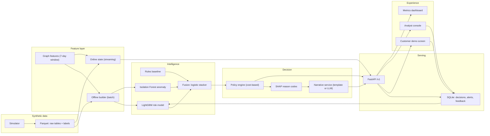

# GoldenMinutes: ARCHITECTURE.md

> Reference for humans and AI coding agents. This file is the source of truth for design decisions.
> If the code and this file disagree, stop, decide which is right, and update this file in the same change.
> All numeric defaults are **starting assumptions**, not facts about upay. Record every change in `docs/assumptions.md`.

---

## 0. Agent working agreement

1. Read this whole file before writing code. Work **one phase at a time** (Section 19) and stop at each "Done when" check.
2. Do not invent data fields, endpoints, or thresholds. If something is missing, add it to Section 21 and ask the human.
3. Keep thresholds, costs, and text in `configs/*.yaml`. Never hard-code them.
4. Every random process takes a seed from config. The same seed must reproduce the same data and models.
5. Write tests with each module. Run `make test` and `make lint` before saying a phase is done.
6. No network calls in tests. The LLM provider defaults to the offline template provider.
7. Never commit `data/`, `models/`, `.env`, or secrets.
8. Keep commits small, with one concern each.

## 1. Product in one page

**GoldenMinutes** is a real-time scam and mule interception layer for a mobile financial service (MFS). It scores each send-money request in the first minutes, using the sender context **and** the recipient wallet's network, and applies a proportionate action: `allow`, `warn`, `verify`, or `hold` (human review).

**Problem statement:** For upay customers and the risk team, scam transfers to mule wallets leave little time to recover money and investigations are slow. We build an AI interception layer that uses transaction, device, and wallet-network signals to score each transfer, trigger a proportionate action, and explain it in plain Bangla. Success is measured by the share of fraud value stopped before cash-out at a fixed false-friction rate.

**Users:** customer (sender), risk analyst, and the demo audience (judges).

**Three questions every alert must answer:** What happened? Why is it risky? What should upay do next?

**Non-goals:** autonomous account freezing or denial, real customer data, a general chatbot, and a model-accuracy leaderboard.

## 2. Hard constraints (non-negotiable)

| # | Constraint | Source |
|---|---|---|
| C1 | Synthetic data only. No real personal data, ever. | Hackathon guideline |
| C2 | Keep a clean test set that is never used for training or tuning. | Hackathon guideline |
| C3 | Keep business rules separate from ML predictions. | Hackathon guideline |
| C4 | Separate data preparation from model inference. | Hackathon guideline |
| C5 | Sensitive decision logic must not live in a free-form LLM prompt. The LLM only explains. | Hackathon guideline |
| C6 | No autonomous deny or freeze. `hold` means pending human review with a visible status. | Hackathon guideline |
| C7 | Every decision carries reason codes and model and policy versions. | Hackathon guideline |
| C8 | Features must be **point-in-time correct** (use only events strictly before the transaction time). | Design |
| C9 | Online (API) and offline (training) features must match, which is proven by a parity test. | Design |
| C10 | Document every synthetic assumption in `docs/assumptions.md`. | Hackathon guideline |

## 3. System overview



**Request lifecycle (`POST /v1/score`):**

1. Validate the request against the Pydantic schema.
2. Build features from online state, using only events before `ts` (C8).
3. Run the rules baseline, the LightGBM model, and the anomaly model.
4. Fuse the signals into one calibrated `risk_score` in [0, 1].
5. Run the policy engine, where hard rules override ML (C3), and get an `action`.
6. Compute SHAP reason codes and map them to bilingual text.
7. Build the customer message. If the action is `hold`, create an alert with priority and deadline.
8. Persist the decision, update online state, and return the response.

## 4. Repository layout

```text
goldenminutes/
├── ARCHITECTURE.md
├── CLAUDE.md                  # one line: "Read ARCHITECTURE.md before any change"
├── README.md
├── Makefile
├── pyproject.toml
├── .env.example
├── configs/
│   ├── simulator.yaml
│   ├── features.yaml
│   ├── models.yaml
│   ├── policy.yaml
│   └── reasons.yaml           # reason code -> en/bn text
├── docs/
│   ├── assumptions.md         # every synthetic assumption (C10)
│   ├── data_dictionary.md
│   └── model_card.md
├── data/                      # gitignored
│   ├── raw/
│   └── processed/
├── models/                    # gitignored; includes registry.json
├── reports/                   # eval outputs: metrics.json, tables, figures
├── src/goldenminutes/
│   ├── common/                # config.py, schemas.py, logging.py, time.py
│   ├── simulator/             # population.py, behavior.py, typologies/, generate.py
│   ├── features/              # offline.py, online.py, graph.py, specs.py
│   ├── rules/                 # baseline.py
│   ├── models/                # risk_lgbm.py, anomaly.py, fusion.py, calibration.py, registry.py, train.py
│   ├── explain/               # shap_explainer.py, reasons.py
│   ├── policy/                # engine.py, cost.py
│   ├── llm/                   # provider.py, template_provider.py, guards.py, narrative.py
│   ├── api/                   # main.py, routes/, store.py, deps.py
│   ├── eval/                  # metrics.py, ablation.py, fairness.py, run_eval.py
│   └── demo/                  # scenarios.py, replay.py
├── tests/
└── ui/                        # Vite + React + TypeScript
    └── src/
        ├── api/
        ├── pages/             # CustomerDemo.tsx, AnalystConsole.tsx, Metrics.tsx
        ├── components/
        └── locales/           # en.json, bn.json
```

## 5. Tech stack and conventions

| Area | Choice | Notes |
|---|---|---|
| Language | Python 3.11+ | Type hints everywhere, `ruff` for lint and format |
| Data | pandas, numpy, pyarrow | Parquet for raw and processed tables |
| ML | scikit-learn, LightGBM, SHAP | Pin versions in `pyproject.toml` |
| Graph | NetworkX + GraphSAGE (MuleGraphSAGE, `models/gnn.py`) | Phase 1: GNN embeddings now active in Variant E (champion). Pre-trained embeddings cached to `data/processed/<profile>/gnn_embeddings.parquet`. LightGBM must be imported before torch on macOS (documented in `gnn.py`). |
| API | FastAPI, Pydantic v2, uvicorn | Versioned under `/v1` |
| Storage | SQLite via SQLAlchemy | Postgres-compatible, switchable by `GM_DB_URL` |
| Frontend | Vite, React, TypeScript, Tailwind CSS, React Router | Charts: Recharts. Graph view: react-force-graph-2d. Optional openapi-typescript |
| Bangla UI | Noto Sans Bengali | Strings live in `locales/`. A native speaker must review them |
| Tests | pytest, httpx, Vitest + React Testing Library | Property-style invariants for simulator, component/smoke tests for UI |
| Locale | Currency BDT, timezone `Asia/Dhaka` | Store timestamps with timezone |

## 6. Data model

All IDs are synthetic strings. Ground-truth labels live in a **separate table** so feature code can never read them by accident.

**Raw tables (Parquet):**

| Table | Columns |
|---|---|
| `customers` | `customer_id`, `age_band`, `region_type` (urban, semi_urban, rural), `persona`, `registered_at`, `kyc_level` (basic, full) |
| `wallets` | `wallet_id`, `customer_id` (nullable), `owner_type` (customer, agent, merchant), `opened_at`, `opened_via_agent_id` (nullable), `status` |
| `agents` | `agent_id`, `region_type`, `opened_at` |
| `device_links` | `wallet_id`, `device_id`, `first_seen_at`, `last_seen_at` |
| `auth_events` | `event_id`, `wallet_id`, `ts`, `event_type` (pin_reset, sim_change, new_device_login), `device_id` |
| `transactions` | `txn_id`, `ts`, `type` (send_money, cash_in, cash_out, merchant_pay, bill_pay, add_money_card), `sender_wallet_id`, `recipient_wallet_id` (nullable), `agent_id` (nullable), `amount_bdt`, `channel` (app, ussd, agent), `device_id`, `session_seconds`, `balance_before` |
| `confirmations` | `wallet_id`, `confirmed_at`, `source` (simulates analyst confirmations with lag and detection rate, never emitted for held-out typology) |
| `labels` | `txn_id`, `is_fraud`, `typology`, `case_id`, `is_mule_recipient` |
| `hidden_truth` | `wallet_id`, `is_mule`, `mule_ring_id`, `agent_is_collusive` (for evaluation only) |

**API state tables (SQLite):**

| Table | Columns |
|---|---|
| `decisions` | `decision_id`, `txn_id`, `ts`, `risk_score`, `action`, `reason_codes` (JSON), `model_version`, `policy_version`, `latency_ms` |
| `alerts` | `alert_id`, `decision_id`, `status` (open, in_review, resolved, late), `priority`, `money_at_risk`, `deadline_ts`, `created_at` |
| `analyst_actions` | `alert_id`, `ts`, `action` (approve, release, escalate), `note` |
| `feedback` | `feedback_id`, `decision_id`, `source` (customer, analyst), `label` (this_was_me, not_me, fraud, legit), `ts` |

## 7. Simulator specification

**Profiles** (set in `configs/simulator.yaml`):

| Profile | Customers | Agents | Merchants | Days | Use |
|---|---|---|---|---|---|
| `small` | 2,000 | 40 | 100 | 30 | Tests and quick iteration |
| `full` | 20,000 | 400 | 1,500 | 90 | Training and evaluation |

**Time split (full):** days 1–60 train, 61–75 validation (calibration, fusion, thresholds), 76–90 test. Never split randomly.

**Legitimate behavior (must include confounders):**

- Personas with different amount scales and frequencies (salaried, student, small trader, remittance receiver).
- Legitimate large sends to new recipients (rent, tuition, family), so a "new recipient plus big amount" rule creates false positives.
- Legitimate high fan-in wallets (merchants, billers, shops), so graph features must separate mule fan-in from merchant fan-in.
- Weekly, monthly, and festival seasonality.
- Normal cash-out delays that range from minutes to days.

**Injected typologies** (each writes rows to `labels`; fraud should be roughly 0.2–0.6% of transactions overall):

| Typology | Pattern to generate |
|---|---|
| `impersonation_scam` | Victim sends an unusually large amount to a new recipient after a short session. The recipient receives from several victims and cashes out within minutes. |
| `mule_ring` | 5–15 wallets, with fan-in followed by pass-through chains, shared devices, and cash-out at a small set of agents. |
| `sim_swap_takeover` | Recent SIM change or PIN reset, then a new device, then a drain of most of the balance to a new recipient. |
| `card_to_wallet_burst` | Many small card add-money events into a fresh wallet, then a fast send or cash-out. |
| `agent_collusion` | An agent with abnormal cash-out volume for linked wallets, with amounts structured just under limits. |

**Held-out typology:** `agent_collusion`. Remove its fraud rows from training, validation, and calibration, and keep them in test only. Report recall on it separately as the generalization test.

**Adaptive fraudster (stretch):** after a rule fires, the simulator splits amounts below the rule thresholds. Used to show the model degrades gracefully.

**Sanity invariants (tested):** fraud share in range, each typology has enough positives in `full`, labels are never joined into feature tables, timestamps are monotone per wallet, and the same seed gives identical output.

## 8. Feature specification

Compute every feature as of `ts`, using only events with timestamps strictly before `ts` (C8).

| Group | Features |
|---|---|
| Sender | `amount_to_median_ratio` (vs sender's 30-day median, 1 if no history), `sender_txn_count_1h`, `sender_txn_count_24h`, `sender_amount_sum_24h`, `sender_tenure_days`, `balance_drain_ratio`, `hour_of_day`, `is_night` |
| Pair | `is_first_time_pair`, `pair_history_count` |
| Device and auth | `new_device_flag`, `minutes_since_pin_reset` (capped), `minutes_since_sim_change` (capped), `session_seconds` |
| Recipient | `recipient_age_days`, `recipient_owner_type_code`, `recipient_unique_senders_1h`, `recipient_unique_senders_24h`, `recipient_first_time_sender_share_24h`, `recipient_inflow_24h`, `recipient_outflow_24h`, `recipient_pass_through_ratio_24h`, `recipient_median_receipt_to_out_minutes` |
| Graph (7-day window) | `recipient_fan_in_7d`, `recipient_fan_out_7d`, `shared_device_wallet_count`, `component_size_7d` (previous day's snapshot), `two_hop_confirmed_mule_share` (reads `confirmations` with `confirmed_at <= ts`, never `labels`) |
| GNN (Phase 1) | `gnn_recipient_mule_score`, `gnn_sender_mule_score`, `gnn_recipient_emb_0..3` — MuleGraphSAGE 2-layer (hidden 32, emb 4), trained on the same P2P graph using node-level graph-features as input. Embeddings pre-computed once per profile and loaded from `gnn_embeddings.parquet`. |

**Two implementations, one definition:**

- `features/offline.py` builds features for a whole dataframe, for training and evaluation.
- `features/online.py` keeps per-wallet rolling state and builds features for one request.
- **Parity test (C9):** replay a sample of transactions through both paths and assert equal feature values within tolerance.

## 9. Models

**Evaluation variants (all trained on the same split):**

| Variant | Description |
|---|---|
| A | Rules baseline only |
| B | LightGBM without graph features |
| C | LightGBM with graph features |
| D | C + anomaly score, fused (logistic stacker) |
| E | C + GNN embeddings (MuleGraphSAGE) + anomaly score, fused — **live champion** |
| F | No-op diagnostic: all-zero scores, for a leakage floor check |

**Rules baseline (`rules/baseline.py`, illustrative defaults in config):**

- R1: recipient younger than 3 days and amount above a threshold.
- R2: amount above 80% of balance and a first-time recipient.
- R3: PIN reset or SIM change within 60 minutes and a high amount.
- R4: five or more unique senders to a recipient in one hour, mostly first-time.
- R5: three or more receipts cashed out within 10 minutes each.

**Risk model:** LightGBM binary classifier, class weighting for imbalance, early stopping on validation, and isotonic calibration fitted on validation only.

**Anomaly model:** Isolation Forest trained on legitimate training rows, scored as a percentile rank in [0, 1].

**Fusion:** logistic regression on validation predictions, with inputs `logit(p_lgbm)`, `anomaly_score`, and `rules_hit_count`. The output is the final `risk_score`. Keep it transparent and avoid deep stacking. **Do not use `class_weight="balanced"` in the stacker** — the policy engine treats its output as a calibrated probability (expected loss = p × amount) so a prior shift to 50/50 inflates scores at a ~0.5% base rate.

**Registry:** every trained artifact gets a version string and an entry in `models/registry.json` (training window, config hash, metrics). The API loads the active version.

## 10. Explainability and reason codes

- Use SHAP `TreeExplainer` on the LightGBM model. Take the top positive contributors.
- Map features to **reason codes** with `configs/reasons.yaml`, and attach bilingual text.
- Each decision returns at most three reason codes with weights.

Initial codes: `RECIPIENT_NEW`, `RECIPIENT_FAN_IN_BURST`, `RECIPIENT_FAST_PASS_THROUGH`, `AMOUNT_UNUSUAL_FOR_SENDER`, `DEVICE_OR_PIN_CHANGE_RECENT`, `FIRST_TIME_PAIR`, `RING_LINK`.

```yaml
# configs/reasons.yaml (Bangla text needs native-speaker review)
RECIPIENT_NEW:
  en: "This number is new on upay."
  bn: "এই নম্বরটি upay-তে নতুন।"
RECIPIENT_FAN_IN_BURST:
  en: "Many people sent money to this number for the first time in a short time."
  bn: "অল্প সময়ে অনেকে প্রথমবার এই নম্বরে টাকা পাঠিয়েছেন।"
RECIPIENT_FAST_PASS_THROUGH:
  en: "This number usually moves received money out within minutes."
  bn: "এই নম্বরটি টাকা পাওয়ার কয়েক মিনিটের মধ্যেই তা সরিয়ে ফেলে।"
AMOUNT_UNUSUAL_FOR_SENDER:
  en: "This amount is much larger than you usually send."
  bn: "এই পরিমাণ আপনার সাধারণ লেনদেনের তুলনায় অনেক বেশি।"
DEVICE_OR_PIN_CHANGE_RECENT:
  en: "Your PIN or device changed recently."
  bn: "সম্প্রতি আপনার পিন বা ডিভাইস পরিবর্তন হয়েছে।"
SAFE_ACTION_HINT:
  en: "Before sending, call the person on a number you already have."
  bn: "পাঠানোর আগে আপনার জানা নম্বরে সরাসরি ফোন করে নিশ্চিত হয়ে নিন।"
```

## 11. Policy engine

The policy engine is **deterministic code driven by config**, separate from the models (C3).

```yaml
# configs/policy.yaml (all values are ASSUMPTIONS to calibrate and stress-test)
version: "0.1"
actions: [allow, warn, verify, hold]
effectiveness: {allow: 0.0, warn: 0.25, verify: 0.55, hold: 0.90}
friction_cost_bdt: {allow: 0, warn: 5, verify: 30, hold: 200}
min_amount_bdt_for_intervention: 300
hold_capacity_per_hour: 20
golden_window_minutes: 30
hard_rules: [recipient_blocklisted]
```

**Decision rule:**

1. If a hard rule fires, the action is `hold`.
2. If `amount < min_amount_bdt_for_intervention`, the action is `allow`.
3. Otherwise, for each action `a`: `expected_cost(a) = p * amount * (1 - effectiveness[a]) + (1 - p) * friction_cost[a]`, where `p` is the calibrated `risk_score`. Pick the cheapest action, and break ties toward less friction.
4. If `hold` is chosen but the hourly hold capacity is used up, fall back to `verify`.
5. The engine never returns `deny` (C6).

**Alert priority:** `priority = p * amount * (1 + urgency)`, where `urgency = clip(1 - time_left / golden_window_minutes, 0, 1)` and `time_left = golden_window_minutes - minutes_since_recipient_first_inflow`. If funds are already cashed out, set alert status to `late`.

**Sensitivity analysis:** the eval harness must re-run results across a grid of effectiveness and friction values, so conclusions do not depend on a single guess.

## 12. Narrative service (LLM optional)

**Interface:** `NarrativeProvider` with two methods:

- `summarize_case(evidence) -> CaseNarrative` for analysts.
- `customer_warning(evidence, lang) -> str` for customers, in `bn` or `en`.

**Providers:**

- `TemplateProvider` is the **default** and works offline. It fills text from `reasons.yaml`.
- `LLMProvider` is optional and selected with `GM_LLM_PROVIDER`. Keep it provider-agnostic.

**Guardrails (`llm/guards.py`):**

1. The LLM receives only a structured evidence object (scores, reason codes, counts, amounts). No raw free text.
2. Any free-text field, such as a transaction reference, is treated as untrusted data. Strip it, or pass it as a quoted value in a separate field that instructions never follow.
3. Validate output: it may mention only reason codes present in the evidence, numbers must match the evidence, and length and language are checked.
4. If validation fails or the provider errors, fall back to `TemplateProvider`.
5. LLM output never changes `risk_score` or `action`.

## 13. API contract (`/v1`)

| Method and path | Purpose |
|---|---|
| `POST /v1/score` | Score a send-money request and return the action |
| `GET /v1/alerts` | List alerts, sorted by priority, with filters |
| `GET /v1/alerts/{id}` | Alert detail: score, reasons, evidence, narrative |
| `POST /v1/alerts/{id}/decision` | Analyst action: `approve`, `release`, `escalate` |
| `POST /v1/feedback` | Customer or analyst label: `this_was_me`, `not_me`, `fraud`, `legit` |
| `GET /v1/graph/{wallet_id}` | Local wallet graph for the analyst view |
| `GET /v1/metrics` | KPIs from `reports/` and live counters |
| `POST /v1/simulate/attack` | Demo: replay a scripted scam scenario |
| `POST /v1/simulate/reset` | Demo: reset simulation state (alerts, decisions, feedback) |
| `GET /health` | Liveness and active model and policy versions |

**Authentication and Roles:**
Requests authenticate via the `X-API-Key` header with roles `customer_demo` and `analyst`. Keys are configured via environment variables (`GM_CUSTOMER_KEY`, `GM_ANALYST_KEY`). Endpoints such as `/v1/alerts*` require the `analyst` role.

**`POST /v1/score` request:**

```json
{
  "txn_id": "T000123",
  "ts": "2026-02-14T10:22:31+06:00",
  "type": "send_money",
  "sender_wallet_id": "W000001",
  "recipient_wallet_id": "W000002",
  "amount_bdt": 25000,
  "channel": "app",
  "device_id": "D000009",
  "balance_before": 28000
}
```

**Response:**

```json
{
  "txn_id": "T000123",
  "risk_score": 0.91,
  "action": "hold",
  "reason_codes": [
    {"code": "RECIPIENT_FAN_IN_BURST", "weight": 0.34},
    {"code": "RECIPIENT_NEW", "weight": 0.21}
  ],
  "customer_message": {"bn": "...", "en": "..."},
  "alert_id": "A000077",
  "model_version": "m-0.1.0",
  "policy_version": "0.1",
  "latency_ms": 42
}
```

**Rules:** errors use a consistent `{ "error": { "code", "message" } }` shape. Every request gets a request ID in logs. Target p95 latency for `/score` is under 150 ms on the demo machine (in-process, no external calls). Design the API so it could later connect to a real backend without changing the contract.

## 14. Frontend specification

Three screens plus an `en`/`bn` language toggle. All data comes from `/v1`.

1. **Customer demo:** a send-money form. After submit, show the result: allow (success), warn (Bangla warning with reasons and "continue or cancel"), verify (cooling-off or trusted-contact step), or hold (status card with review target time and "this was me" feedback).
2. **Analyst console:** alert queue sorted by priority, with money at risk and time left. Detail view shows risk score, reason codes, the local wallet graph, the narrative summary, and the buttons approve, release, and escalate.
3. **Metrics:** fraud value intercepted, false-friction rate, median time to decision, hold-resolution time, the ablation table (variants A–D), held-out typology result, and fairness slices.

Plus a **"Run attack"** control that calls `/v1/simulate/attack` and animates the scenario live. Keep one API client module in `ui/src/api/`. Show loading and error states.

## 15. Evaluation harness (`make eval` writes `reports/metrics.json`)

| Metric | Definition |
|---|---|
| False-friction rate (FFR) | Share of legitimate transactions that receive `warn`, `verify`, or `hold`. Report the operating point with FFR at or below the configured cap (default 1%). |
| Value-weighted recall | Share of fraud **value** receiving `verify` or `hold` at that FFR |
| Expected intercepted value | Sum of `amount * effectiveness[action]` over fraud transactions (assumption-dependent, so show with the sensitivity grid) |
| Precision at K | Precision in the top K alerts, where K is the analyst capacity per day |
| Time to decision | Median and p95 latency of the scoring path |
| Held-out typology | Recall and value-weighted recall on `agent_collusion` |
| Calibration | Brier score and reliability curve |
| Ablation | Variants A–D side by side, including PR-AUC and p95 latency |
| Fairness | FFR and recall by `age_band`, `region_type`, and account tenure bucket. Flag large gaps for review, and do not hide them. |

Report **no accuracy headline**. Show uncertainty (bootstrap intervals) where practical.

## 16. Security and responsible AI checklist

- [ ] Synthetic data only (C1), with assumptions documented (C10).
- [ ] Reason codes on every decision (C7), and bilingual text reviewed by a native speaker.
- [ ] No deny or freeze path. `hold` always has an analyst resolution path (C6).
- [ ] Fairness slices computed and reported.
- [ ] Prompt-injection test: hostile text in a transaction reference field must not change the action, the score, or the narrative's facts.
- [ ] Role-based access on analyst endpoints via `X-API-Key` (`customer_demo` and `analyst` roles, keys from env), and audit log of analyst actions.
- [ ] No sensitive values in logs. IDs only.
- [ ] `docs/model_card.md` states intended use, data, limits, and known failure modes.

## 17. Config, environment, and Makefile

**`.env.example`:**

```text
GM_ENV=dev
GM_DB_URL=sqlite:///./goldenminutes.db
GM_MODEL_DIR=./models
GM_LLM_PROVIDER=template
GM_LLM_API_KEY=
GM_DEFAULT_LANG=bn
GM_SEED=42
```

**Makefile targets:**

| Target | Action |
|---|---|
| `make setup` | Install Python and UI dependencies |
| `make data` | Generate synthetic data (`PROFILE=small` or `full`) |
| `make features` | Build offline features |
| `make train` | Train variants A–D and register the model |
| `make eval` | Run evaluation, ablation, fairness, and sensitivity, then write `reports/` |
| `make api` | Run the FastAPI server |
| `make ui` | Run the UI dev server |
| `make demo` | Start API and UI and load the demo scenario |
| `make test` / `make lint` | Run pytest and ruff |

## 18. Testing strategy

- **Simulator:** the invariants in Section 7 and reproducibility by seed.
- **Features:** point-in-time tests (a future event must not change a past feature), plus the online/offline **parity test**.
- **Leakage:** a test that fails if any feature column is derived from `labels` or `hidden_truth`. `two_hop_confirmed_mule_share` reads `confirmations`, never `labels`.
- **Rules and policy:** table-driven unit tests for each rule and each branch of the decision rule, including capacity fallback.
- **API:** contract tests with `httpx`, schema validation, and error shapes.
- **LLM guards:** fallback on validation failure, number-mismatch rejection, and the prompt-injection test.
- **Frontend:** a smoke test that each page renders against a mocked API.

## 19. Build plan (phases and "Done when")

| Phase | Deliverable | Done when |
|---|---|---|
| P0 Scaffold | Repo layout, config loader, Makefile, CI-style lint and test | `make test` and `make lint` pass on an empty-but-wired project |
| P1 Simulator | Generators for population, legitimate behavior, and 5 typologies | `make data PROFILE=small` is reproducible, invariants pass, `docs/data_dictionary.md` and `docs/assumptions.md` exist |
| P2 Features, rules, eval harness | Offline features, rules baseline, metrics module | Point-in-time and leakage tests pass, and variant A metrics are written to `reports/` |
| P3 Models | LightGBM, Isolation Forest, fusion, calibration, registry | Variants B–D trained on the `full` profile, ablation table produced, held-out typology result reported |
| P4 Policy and API | Online state, policy engine, `/score` and alert endpoints | Parity test passes, contract tests pass, p95 latency measured and recorded |
| P5 Explain and narrative | SHAP reason codes, template provider, guards | Every response has reason codes with bilingual text, and injection tests pass |
| P6 UI | Customer, analyst, and metrics screens, plus "Run attack" | The demo script (Section 20) runs end to end without manual fixes |
| P7 Hardening | Fairness and sensitivity reports, model card, README | All checklist items in Section 16 are ticked or have a written reason |

**Stretch (only after P7):** adaptive fraudster, SMS or voice channel, optional LLM provider, Docker Compose, Postgres.

## 20. Demo script (about 3 minutes)

1. **Problem:** state the problem and the "golden minutes" idea in two sentences.
2. **Normal send:** a normal transfer to a known recipient passes with no friction.
3. **Attack replay:** click "Run attack". A victim sends a large amount to a new wallet. The customer screen shows a Bangla warning with the reason and a call-first hint.
4. **Analyst view:** the alert appears at the top of the queue with money at risk and time left. Open it: reason codes, the ring graph, and the AI summary.
5. **Human decision:** the analyst holds or releases. Show the status the customer sees.
6. **Evidence:** show the ablation table (rules vs ML vs ML plus graph), the held-out typology result, FFR, and the fairness slices.
7. **Path to production:** the `/score` API, shadow mode on governed data, and human oversight.

## 21. Open decisions (the agent must ask, not guess)

- [ ] Final held-out typology (default is `agent_collusion`).
- [ ] SQLite or Postgres for the demo.
- [ ] Whether to enable a real LLM provider or stay on templates.
- [ ] Realistic receipt-to-cash-out latency and transaction limits (confirm with upay mentors if possible).
- [ ] Native-speaker review of all Bangla strings.
- [ ] Operating-point FFR cap and analyst capacity per hour.
- [ ] Whether to include the trusted-contact verification step in the demo or only describe it.
