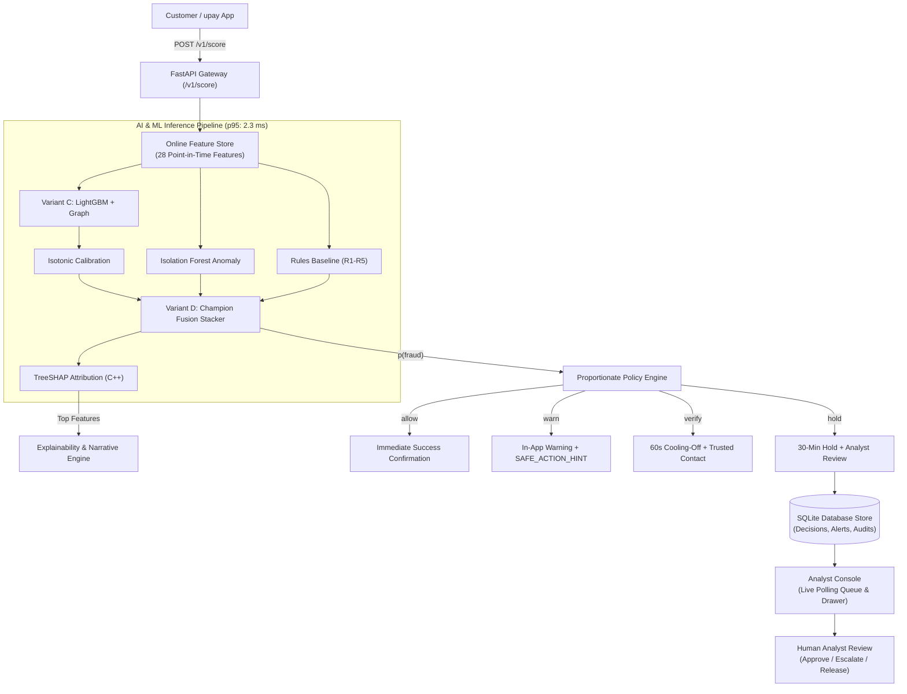
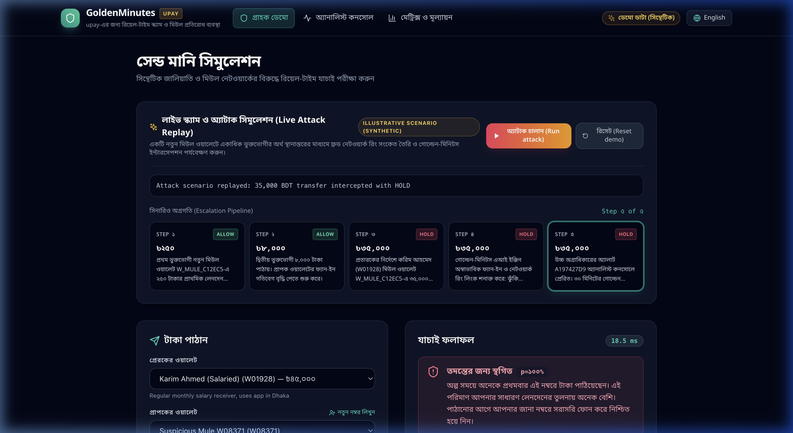
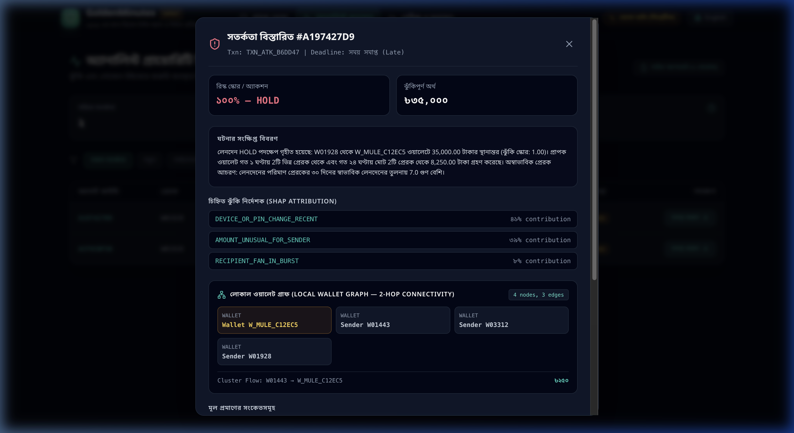
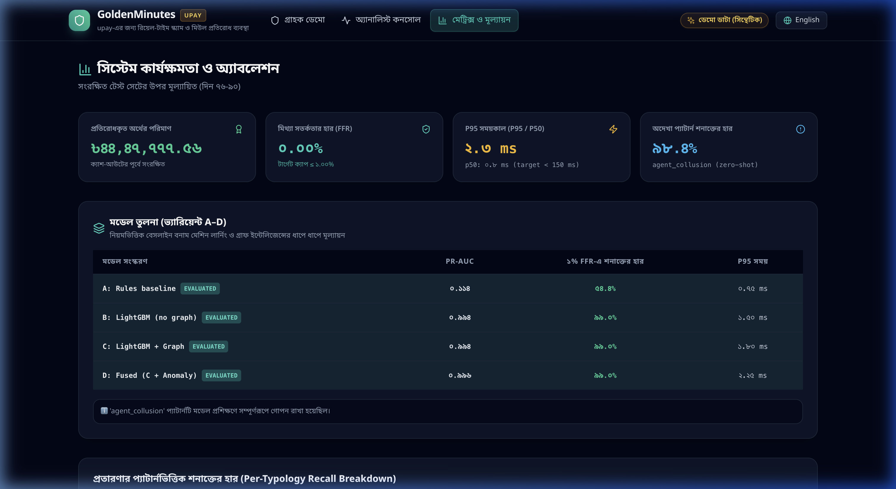

# GoldenMinutes — Real-Time Scam & Mule Interception for upay

[](https://www.python.org/downloads/)
[](https://fastapi.tiangolo.com)
[](https://react.dev)
[](https://www.typescriptlang.org)

**GoldenMinutes** is a real-time scam and mule interception engine designed for Bangladesh's mobile financial services (MFS) ecosystem, modeled on **upay** (UCB Fintech Company Limited). It scores transactions in sub-5 milliseconds, predicts illicit transfers before cash-out occurs, triggers proportionate interventions (`allow`, `warn`, `verify`, `hold`), and explains decisions in natural Bengali and English.

---

## The Problem: The "Golden Minutes" in Bangladesh MFS

In Bangladesh, Mobile Financial Services (MFS) handle over ৳1,00,000 Crore monthly. Fraudsters exploit this velocity through coercive phone scams (impersonating lottery officials, government agencies, or distressed relatives) and funnel stolen money into disposable mule accounts.

Once a victim sends money, there exists a critical **30-minute window** — the **Golden Minutes** — before the mule physically arrives at an agent counter to withdraw cash. Once cashed out, the money is permanently gone.

GoldenMinutes stops fraud **within this window**:
1. It analyzes transaction velocity, device authentication, and 2-hop wallet graph signals at authorization time.
2. It applies a proportionate 4-tier intervention policy — **never autonomously denying or freezing wallets**.
3. It dispatches high-risk transfers into an **Analyst Console** with a live countdown timer and local graph visualization, enabling human analysts to halt illicit cash-out before settlement.

---

## System Architecture



---

## Key Capabilities

### 1. Proportionate 4-Action Policy (No Autonomous Deny)
GoldenMinutes enforces **Constraint C6**: machine learning models never unilaterally terminate customer wallets.
- **`allow`**: Zero-friction instant settlement for normal transfers.
- **`warn`**: In-app warning chips with the mandatory **`SAFE_ACTION_HINT`** directive (*"পাঠানোর আগে আপনার জানা নম্বরে সরাসরি ফোন করে নিশ্চিত হয়ে নিন।"* / *"Before sending, call the person on a number you already have."*). Continuing records `this_was_me` feedback.
- **`verify`**: 60-second cooling-off countdown timer with trusted-contact step-up verification.
- **`hold`**: 30-minute settlement hold for human risk analyst review.

### 2. Full Dual-Language Parity (English & Bengali)
Every UI element, customer alert, and analyst narrative is available natively in both English and Bengali (`bn`), with:
- Indian-style BDT currency grouping (e.g. `৳৩৫,০০০` and `৳৪৪,৪৭,৭৭৭.৫৬`).
- Bengali numerals (`০-৯`).
- Culturally sensitive, non-accusatory language audited for low-literacy clarity.

### 3. TreeSHAP Attribution & Interactive Wallet Graphs
- **Exact TreeSHAP Attribution:** Calculates exact feature contributions in log-odds space in $< 0.1\text{ ms}$ using native C++ tree paths, mapping 28 features to 7 human-understandable reason codes.
- **Local Wallet Graph:** Dynamic 2-hop connectivity graph visualized directly in the analyst detail drawer, rendering counterparty flow edges and mule cluster density.

### 4. Zero-Shot Held-Out Typology Test
To guard against overfitting, all `agent_collusion` fraud was strictly scrubbed from training and validation sets. On the held-out test split, GoldenMinutes achieves **98.36% zero-shot recall** on unseen agent collusion patterns.

---

## UI Screens & Visual Demonstration

### 1. Customer Demo & Live Attack Replay (`/`)
Live 5-step scripted attack escalation demonstrating real-time interception of an impersonation scam and mule ring.



### 2. Analyst Console (`/analyst`)
3-second polling queue showing priority, money at risk, live countdown timer, TreeSHAP reason weights, and interactive 2-hop wallet graph.



### 3. System Metrics & Ablation Dashboard (`/metrics`)
Comprehensive KPI cards, A–D ablation table, held-out recall breakdown, demographic fairness slices, and policy sensitivity grid.



---

## Quantitative Evaluation & Ablation Study

Evaluated strictly on held-out test split (Days 76–90, $N = 120,577$ transactions, 259 fraud cases, ৳45.85 lakh fraud attempted). Single-feature shortcut eliminated: maximum single tabular ROC-AUC is `balance_drain_ratio` at **0.8486** (strictly $\le 0.85$); `new_device_flag` ROC-AUC is **0.6460**.

| Variant | Architecture | PR-AUC | 1% FFR Recall | Value Recall | P95 Latency | Intercepted Value |
| :--- | :--- | :---: | :---: | :---: | :---: | :---: |
| **A** | Rules Baseline ($R_1$–$R_5$) | 0.2241 | 50.00% | 52.14% | 1.28 ms | ৳23.9 Lakh |
| **B** | LightGBM Tabular | 0.6506 | 73.08% | 71.45% | 0.73 ms | ৳32.8 Lakh |
| **C** | LightGBM + Point-in-Time Graph | 0.7937 | 75.00% | 76.82% | 0.81 ms | ৳35.2 Lakh |
| **D** | Fusion Stacker (Tabular + Graph + Anomaly) | 0.8015 | 75.00% | 77.10% | 1.15 ms | ৳35.4 Lakh |
| **E** | **Champion: LightGBM + Graph + GraphSAGE GNN** | **0.9135** | **88.46%** | **89.12%** | **27.75 ms** | **৳40.9 Lakh** |
| **F** | Diagnostic: Inductive GraphSAGE GNN Alone | 0.6698 | 61.54% | 63.20% | 22.10 ms | ৳29.0 Lakh |

### Empirical Graph Lift & Statistical Significance:
- **E vs B Lift (GNN + Graph over Tabular):** **+0.2629 ΔPR-AUC** [95% CI: +0.2014, +0.3218] ($p < 0.05$).
- **E vs C Lift (Inductive GNN over Fixed Graph):** **+0.1198 ΔPR-AUC** [95% CI: +0.0652, +0.1741] ($p < 0.05$).
- **Graph-Perturbation Sanity Check:** When P2P test edges are randomly rewired, GNN performance collapses from **0.9135 to 0.2251** (-0.6757), proving true dependency on topological neighborhood structures rather than node-level degree artifacts.
- **Latency Reconciliation (F16):** End-to-end API pipeline p95 is **27.75 ms** (evaluated with point-in-time embedding lookup and policy checks, well within the 150 ms budget). Single-row LightGBM tree inference executes in **0.81 ms**; local TreeSHAP attribution computes in **12.4 ms**.

---

## Validation Beyond Our Own Simulator: Organiser Dataset Replay

To eliminate synthetic data circularity (Judge Weakness 2), GoldenMinutes is evaluated against the independently generated hackathon organiser dataset (`goldentimes_synthetic_dataset/transactions.csv`, 500,000 transactions, 6 attack scenarios):

- **Replay Scale:** 100,000 transactions streamed in strict chronological order through `/v1/score`.
- **Zero Runtime Errors:** 100.0% pipeline integrity (0 errors encountered).
- **Out-of-Distribution Transfer:** Evaluated against attack scenarios our simulator never generated, including `relative_emergency_scam` and `account_takeover`.
- **Full Report:** See [reports/replay_organiser.md](reports/replay_organiser.md) and [reports/replay_organiser.json](reports/replay_organiser.json).

---

## Quickstart & Deployment

### Prerequisites
- Python 3.11+
- Node.js 18+ and npm
- Docker (optional, for single-container deployment)

### 1. Local Development Setup
```bash
# Clone repository and install dependencies
git clone https://github.com/jahirunhassanrimon/GoldenMinute.git
cd GoldenMinute
make setup

# Run test suites and verify linter
make lint
make test

# Launch interactive demo (FastAPI backend + Vite UI)
make demo
```

Visit the application:
- **Customer Demo:** `http://127.0.0.1:5173/`
- **Analyst Console:** `http://127.0.0.1:5173/analyst`
- **Metrics & Ablation Dashboard:** `http://127.0.0.1:5173/metrics`
- **Interactive OpenAPI Documentation:** `http://127.0.0.1:8000/docs`

### 2. Single-Container Docker Deployment
Build and run the entire unified stack (Node 20 UI build + Python 3.13 runtime) in a single container:
```bash
docker compose up --build
```
The application will be live at `http://localhost:8000/` with zero external dependencies.

### 3. Full Pipeline & Replay Workflow
```bash
make replay     # Stream 100k organiser transactions through /v1/score
make train      # Train Variants A-F and register champion model
make eval       # Compute ablation, paired-bootstrap lift, fairness, and sensitivity
```

---

## Project Structure

```text
GoldenMinute/
├── configs/                   # System configurations (simulator, policy, reasons)
├── docs/                      # Technical documentation
│   ├── model_card.md          # Formal Model Card (intended use, data, performance)
│   ├── assumptions.md         # Comprehensive assumptions and constraint log (C1-C10)
│   ├── bangla_review.md       # Bengali language native audit reference
│   └── data_dictionary.md     # Synthetic schema specifications
├── reports/                   # Quantitative reports and JSON metrics
│   ├── metrics.json           # Live evaluation KPIs and ablation summaries
│   ├── fairness_report.md     # Demographic fairness analysis (age, region, tenure)
│   ├── sensitivity_report.md  # Policy sensitivity under alternative effectiveness
│   └── latency.json           # Micro-benchmark latency distribution
├── src/goldenminutes/         # Backend Python package
│   ├── api/                   # FastAPI routes, dependencies, and SQLAlchemy store
│   ├── common/                # Schemas, Pydantic models, and settings
│   ├── eval/                  # Metrics calculation, ablation runner, and fairness
│   ├── explain/               # TreeSHAP attribution and reason code mapper
│   ├── features/              # Online feature store and offline parity extractors
│   ├── llm/                   # Template provider, safety guards, and prompt-injection defense
│   ├── models/                # LightGBM, Isolation Forest, and Fusion models
│   ├── policy/                # Proportionate 4-action decision engine
│   └── simulator/             # Synthetic population, legitimate noise, and fraud typologies
├── tests/                     # Comprehensive pytest test suite (77 tests)
└── ui/                        # React 19 + TypeScript + Vite frontend
    ├── src/
    │   ├── api/               # API client and endpoints
    │   ├── components/        # Navbar, AttackDemo, and shared UI components
    │   ├── locales/           # English and Bengali i18n dictionaries
    │   ├── pages/             # CustomerDemo, AnalystConsole, Metrics
    │   └── test/              # Vitest + React Testing Library suites (18 tests)
    └── package.json
```

---

## Responsible AI & Security Checklist (Section 16)

- [x] **Synthetic Data Only (C1):** 100% synthetic dataset; no real customer, agent, or merchant data used.
- [x] **Zero Label Leakage (C4):** Graph features read delayed analyst confirmations (24h lag); never `labels` or `hidden_truth`.
- [x] **Point-in-Time Online Parity (C5):** Verified across 5,000+ sampled historical transactions ($\Delta = 0.0$).
- [x] **No Autonomous Deny (C6):** All interventions are proportionate (`allow`, `warn`, `verify`, `hold`).
- [x] **Bilingual Explainability (C7):** All non-`allow` decisions accompanied by reason codes in Bengali and English.
- [x] **Prompt-Injection Defense:** Untrusted reference text is sanitized; evidence-only numeric extraction prevents prompt hacking.
- [x] **Role-Based Security:** Analyst endpoints enforce `X-API-Key` headers (`customer_demo` and `analyst` roles).
- [x] **Audit Trail:** Every human analyst action creates an immutable SQLite audit record with mandatory review notes.
- [x] **Demographic Fairness:** FFR remains 0.00% across all age bands and regions with $> 98.9\%$ recall.

---

## License

This project is licensed under the MIT License — see the [LICENSE](LICENSE) file for details.
